# <i class="icon-beaker"></i> 3X Tutorial with Examples

In this document, we explain how you can set up and conduct computational experiments with <span class="sans-serif">3X</span> using two examples.
This step-by-step guide will introduce important features of <span class="sans-serif">3X</span> and will teach you how to use them through detailed instructions.
We assume you already have <span class="sans-serif">3X</span> installed on your system, and can run it using the `3x` command.
Otherwise, follow the [installation instructions](../install/) first.


## Example 1: Studying Sorting Algorithms

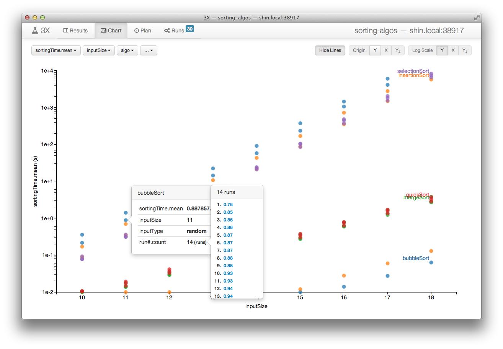

Anyone who has received computer science education or studied basic algorithms would be familiar with different algorithms for sorting an array of data values.
In the algorithms textbook, we learn how to analyze time and space complexities of such algorithms in terms of their asymptotic behavior.
Theoretical analyses of worst or best cases can be covered clearly in text, but average cases require empirical studies experimenting with actual implementations.

Suppose we want to see such an empirical result ourselves of how different sorting algorithms, namely, *bubble sort*, *selection sort*, *insertion sort*, *quick sort*, and *merge sort* behave on several sizes and types of inputs, e.g., when the input is already ordered, reversed, or randomly shuffled.
Implementing these algorithms correctly is obviously important, but what's equally important to obtaining a credible result is running different combinations of inputs and recording every detail in a systematic manner.
Using <span class="sans-serif">3X</span>, we can easily obtain robust, repeatable experimental results with minimal effort.
Therefore, more of our time and energy can be devoted to exploring the parameter space as well as writing the program correctly, which leads our experiments to yield more interesting results and fewer errors.


### 1. Write the Program
First of all, we need to write a program that implements the sorting algorithms we want to test.
Some people may prefer using a serious programming language, such as C, C++, or Java to write an efficient implementation.
Others may use simpler scripting languages, such as Python, Ruby, or Perl for a quick evaluation.
But in the end, there will always be an executable file, or a command and a list of arguments to start our program regardless of the programming language of choice.
This is the only thing <span class="sans-serif">3X</span> needs to know about the program for our experiment, and we will see where this information should be placed after we create an *experiment repository* in the following step.

To keep this tutorial simple, let's assume we already wrote Python code for experimenting with sorting algorithms as in the following two files:

* [`sort.py`][]
    containing each sorting algorithm as a separate Python function.

* [`measure.py`][]
    containing code that measures how long a chosen sorting algorithm takes to finish for a generated input.

[`sort.py`]:    ../examples/sorting-algos/program/sort.py
[`measure.py`]: ../examples/sorting-algos/program/measure.py

To obtain a single measurement with this program, we would a run command such as:

```bash
python measure.py quickSort 2000 random
```

which outputs, for instance:

```text
input sorted ratio: 0.5035
output sorted ratio: 1.0
sorting time (s): 0.019361
verification time (s): 0.000435
input generation time (s): 0.001514
number of compares: 26211
number of accesses: 68608
```


### 2. Set Up an Experiment Repository

To keep everything related to our experiment well organized, we need to tell <span class="sans-serif">3X</span> to create a new *experiment repository* for us.
Every detail from the definition of input/output and program to the individual records of past executions and plans for future runs will be stored and managed inside this repository.
It is a typical directory (or folder) on the filesystem with a special internal structure.

<span class="sans-serif">3X</span> provides two different ways to set up a new experiment repository: a quick one-liner setup, or a slightly more lengthy step-by-step way.
The quick setup will be useful for creating entirely new experiments from scratch, while the step-by-step setup can be useful for adjusting your existing experiment definitions.
You can either follow the first "Quick Setup" section and skip the rest, or follow the individual steps introduced in the sections that follows "Quick Setup."
In either ways, let's say we want our repository to be called `sorting-algos`. 

#### Quick Setup

The single command shown below will create and set up a new repository for our experiment on sorting algorithms.
It is simply an abbreviation for the multiple steps necessary to initialize the experiment repository and to define its input and output.

```bash
# create and setup a new experiment repository
3x setup sorting-algos \
 --program \
   'python measure.py $algo $dataSize $dataOrder' \
 --inputs \
   algo=bubbleSort,selectionSort,insertionSort,quickSort,mergeSort \
   dataSize=2000,4000,8000 \
   dataOrder=random,ordered,reversed \
 --outputs \
   --extract 'sorting time \(s\): {{sortingTime(s) =~ .+}}' \
   --extract 'number of compares: {{numCompare =~ .+}}' \
   --extract 'number of accesses: {{numAccess =~ .+}}' \
   --extract 'input sorted ratio: {{ratioSortedIn =~ .+}}' \
   --extract 'output sorted ratio: {{ratioSortedOut =~ .+}}' \
  # end of 3x setup
```
<small>
(Backslash (`\`) at the end of the line indicates the command continues on the next lines.
Everything after the hash (`#`) at the last line is to terminate the last backslash and also the command.
This multi-line style will be used throughout this tutorial to write lengthy shell commands.)
</small>

Note that since this quick setup command creates only the skeleton part of our experiment repository, we still need to place additional files at the right place, namely, the `.py` files of our program.
The following commands will prepare the `program/` directory, which is explained in more detail in [§2.3 (Plug in the Program)](#sortingalgos-plugintheprogram).

```bash
# download our example Python program into the right place
cd sorting-algos/program
exampleURL="https://raw.github.com/netj/3x/gh-pages/docs/examples"
curl -L -O $exampleURL/sorting-algos/program/measure.py \
        -O $exampleURL/sorting-algos/program/sort.py
cd ..
```

If you have followed this quick setup, you can safely ignore the rest of the steps for setting up the repository because they were already taken care by the `3x setup` command you have run.
We're all set to start running our experiment, and let's move on to [§3 (Run Experiments)](#sortingalgos-runexperiments).


#### 2.1. Create an Experiment Repository

The following command creates an empty repository:

```bash
3x init sorting-algos
```

We can now move into the repository to further define our experiment.

```bash
cd sorting-algos
```


#### 2.2. Define Inputs & Outputs
Next, we shall tell <span class="sans-serif">3X</span> what the input parameters to our experimental program are and the output values of interest.

Suppose we want to vary the input size, the initial order of input for different sorting algorithms.
We can tell <span class="sans-serif">3X</span> that we have three input parameters for our experiment in the following steps.

##### Input 1. `algo` for choosing the sorting algorithm to test

The particular sorting algorithms we are interested in are the following five, which are already implemented in [`sort.py`][].
We will use the name of the algorithms as the value for this input parameter.

* `bubbleSort`      for [Bubble Sort](https://en.wikipedia.org/wiki/Bubble_sort#Pseudocode_implementation)
* `selectionSort`   for [Selection Sort](https://en.wikipedia.org/wiki/Selection_sort)
* `insertionSort`   for [Insertion Sort](https://en.wikipedia.org/wiki/Insertion_sort#Algorithm)
* `quickSort`       for [Quick Sort (in-place version)](https://en.wikipedia.org/wiki/Quicksort#In-place_version)
* `mergeSort`       for [Merge Sort (bottom-up implementation)](https://en.wikipedia.org/wiki/Merge_sort#Bottom-up_implementation)

The following command tells <span class="sans-serif">3X</span> to add this parameter to the experiment definition:

```bash
3x define input 'algo' \
  'bubbleSort' 'selectionSort' 'insertionSort' 'quickSort' 'mergeSort' 
```


##### Input 2. `dataSize` for controlling the size of the array to sort

We want to test sorting algorithms on arrays of numbers with different sizes.
We will use arrays of 2,000 unique numbers, and double the size of the arrays up to size 8,000.

We should run the following command to add this parameter:

```bash
3x define input 'dataSize' \
  '2000' '4000' '8000'
```


##### Input 3. `dataOrder` for controlling how much the arrays to sort are already sorted

We also want to see how each sorting algorithm behaves differently for different types of arrays as well as their sizes.
We will use the following three values of this input parameter to indicate which type of input we want to use:

* `ordered` that is already sorted,
* `reversed` that is sorted but in the reversed direction,
* `random` that is shuffled randomly.

The following command will add this last parameter:

```bash
3x define input 'dataOrder' \
  'ordered' 'reversed' 'random'
```


Next, suppose we want to measure the wall clock time as well as the number of compares and array accesses to finish each sorting algorithm.
We can tell <span class="sans-serif">3X</span> to look for lines that match specific patterns in the output of our program to extract the values of interest.
These patterns can be specified in [Perl regular expressions](http://perldoc.perl.org/perlre.html#Regular-Expressions) syntax.
The following steps will show how exactly we can tell <span class="sans-serif">3X</span> to extract the values of interest in the case of this experiment with sorting algorithms.

##### Output 1. `sortingTime` for the time taken to sort

The wall clock time it takes for sorting the input array is what we are mostly interested in in this experiment.
We measure this time in our program in seconds and print that out in a line that begins with `sorting time (s): `.
Therefore, <span class="sans-serif">3X</span> can easily extract the value that follows if we define the output variable as shown in the following command:

```bash
3x define output 'sortingTime(s)' \
  extract 'sorting time \(s\): '  '.+'  ''
```

Here, there are four arguments to the `3x define output` command:

1. name of the output variable: `sortingTime`
2. unit of the output variable: `(s)`
3. regular expression for the text that comes before the value: `sorting time \(s\): `
4. regular expression the value matches: `.+` (any non-empty string)
5. regular expression for the text that comes after the value: (empty string)

Note that we can append the *unit* of the output variable to its name (first argument), which is `(s)` or seconds in this case.
We can use any text for the unit as long as it's surrounded by parentheses.

##### Output 2. `numCompare` for the number of compares taken to sort

Similarly, we can teach <span class="sans-serif">3X</span> to extract the number of compares for the value of an output variable using the following command:

```bash
3x define output 'numCompare' \
  extract 'number of compares: '  '.+'  ''
```


##### Output 3. `numAccess` for the number of array access to sort

As well as the number of accesses to the input array of numbers with:

```bash
3x define output 'numAccess' \
  extract 'number of accesses: '  '.+'  ''
```


##### Output 4. `ratioSortedOut` and `ratioSortedIn`

To ensure correctness, note that we compute the ratio of the numbers in the array that are correctly ordered to the array size, after finishing the sorting algorithm, as `ratioSortedOut`.
This is a simple measure to easily check whether the sorting algorithm was implemented correctly.
When this value comes out less than 1.0, it means the algorithm is incorrect.
We also compute this ratio for the array before sorting, as `ratioSortedIn`, to capture the characteristic of the input for the particular run.
The following command adds these two output variables to the experiment definition.

```bash
3x define output 'ratioSortedIn' \
  extract 'input sorted ratio: '  '.+'  ''
3x define output 'ratioSortedOut' \
  extract 'output sorted ratio: '  '.+'  ''
```


<a name="sortingalgos-plugintheprogram"></a>
#### 2.3. Plug in the Program

The only thing <span class="sans-serif">3X</span> needs to know about our program in order to run experiments on our behalf is the exact command we type into our terminal to start them ourselves.
<span class="sans-serif">3X</span> assumes this information is kept as an executable file named **`run`** under the `program/` directory of the experiment repository.
For each execution of `run`, <span class="sans-serif">3X</span> sets up the environment correctly, so that the value chosen for each input variable we defined earlier can be accessed via the environment variable with the same name.
<span class="sans-serif">3X</span> will also make sure any additional files that are placed next to the `run` executable will also be available in the current working directory while being executed.


First, let's move into the `program/` directory of our repository:

```bash
cd program
```


As we have two Python files necessary for implementing and measuring the sorting algorithms, we will put both of these files under `program/`.
If you don't have these files readily available, let's download them directly from GitHub with the following commands:

```bash
# copy our example Python program into the repository
exampleURL="https://raw.github.com/netj/3x/gh-pages/docs/examples"
curl -L -O $exampleURL/sorting-algos/program/measure.py \
        -O $exampleURL/sorting-algos/program/sort.py
```

(You can probably pass the URLs to `wget` instead if your system doesn't have `curl` installed.)

Next, we need to create a `run` script that starts our Python program as follows:

```bash
cat >run  <<EOF
#!/bin/sh
python measure.py \$algo \$dataSize \$dataOrder
EOF
chmod +x run
```

Now, we're all set to start running our experiment.


<a name="sortingalgos-runexperiments"></a>
### 3. Run Experiments

<span class="sans-serif">3X</span> provides two ways to execute your experiments:
You can use its *graphical user interface* (GUI), or the *command-line interface* (CLI).
The GUI is easy and intuitive to use, but you might want to have more sophisticated control over your execution, or to control <span class="sans-serif">3X</span> from other systems and further automate parts of your experiment using the CLI.
However, it is perfectly fine for you to use both GUI and CLI at the same time, and any changes you make on one side will be reflected to the other.

#### 3.1. Start GUI

To start the GUI, run the following command within the experiment repository:

```bash
3x gui
```

When successfully started, it will output a URL you can open in your web browser to access the GUI.
On a Mac, or a GNU/Linux system running a proper GUI system, <span class="sans-serif">3X</span> will launch the browser for you.

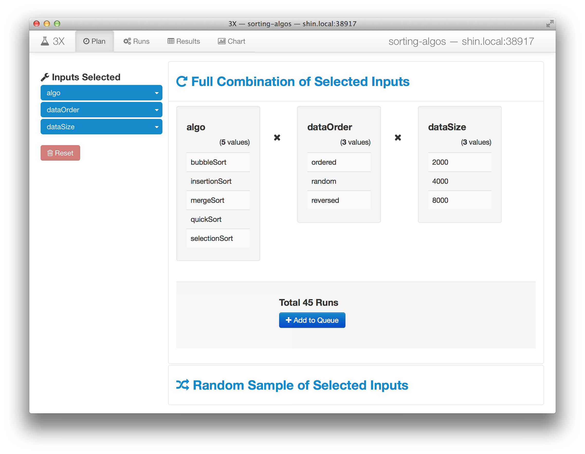

As shown in the above screenshot, the GUI has four tabs: Plan, Runs, Results, and Charts.
The first two tabs are for planning and controlling the execution, while the last two are for exploring the results of execution collected so far.

#### 3.2. Plan Runs

From the Plan tab, we can choose a set of values for each input variable to generate a cross product of them to plan new runs for execution.
It is also possible to pick a random sample from such full combination of values, where you have the option of varying the sampling ratio.
In either ways, by clicking on the "Add to Queue" button at the bottom multiple times, you can add new runs to the current queue as many times as you want.


##### Plan Runs from Command Line

From the command line, under the experiment repository, the following command will achieve the same result as we did in the GUI:

```bash
3x plan algo
```

Specific sets of values for planning the runs can be easily specified with commands similar to the following one:

```bash
3x plan algo=bubbleSort,insertionSort dataSize=2000,4000
```


#### 3.3. Start Runs

The Runs tab shows a list of queues defined in the repository and the target execution environment associated with them on the left-hand side.
On the right-hand side table, all the runs added to the currently selected queue are shown with their states and value bindings for input variables in the order in which they will be executed.


The buttons on the queue from the left-hand side list will let you start and stop the execution of the runs in it.
Pressing the play <i class="icon-play"></i> button on the main queue starts the execution.


##### Start Runs from Command Line

From the command line, you can run the following command to view what runs are in the current queue:

```bash
3x status
```

It will output the table of runs in the current queue that resembles the GUI as follows:

```text
PLANNED  algo=bubbleSort     dataOrder=ordered   dataSize=2000  #1
PLANNED  algo=bubbleSort     dataOrder=ordered   dataSize=4000  #2
PLANNED  algo=bubbleSort     dataOrder=random    dataSize=2000  #3
PLANNED  algo=bubbleSort     dataOrder=random    dataSize=4000  #4
PLANNED  algo=bubbleSort     dataOrder=reversed  dataSize=2000  #5
PLANNED  algo=bubbleSort     dataOrder=reversed  dataSize=4000  #6
PLANNED  algo=insertionSort  dataOrder=ordered   dataSize=2000  #7
PLANNED  algo=insertionSort  dataOrder=ordered   dataSize=4000  #8
PLANNED  algo=insertionSort  dataOrder=random    dataSize=2000  #9
PLANNED  algo=insertionSort  dataOrder=random    dataSize=4000  #10
PLANNED  algo=insertionSort  dataOrder=reversed  dataSize=2000  #11
PLANNED  algo=insertionSort  dataOrder=reversed  dataSize=4000  #12
[...]
```

To start execution, run:

```bash
3x start
```


#### 3.4. Stop Runs

To stop the execution, press the pause <i class="icon-pause"></i> or stop <i class="icon-stop"></i> button on the main queue.


##### Stop Runs from Command Line

To stop execution from the command line, either interrupt the `3x start` process with Ctrl-C, or run the following command:

```bash
3x stop
```


#### 3.5. Monitor Progress

As execution progresses, the state of runs will change from `PLANNED` to `RUNNING`, then to either `DONE` or `FAILED` after finishing.

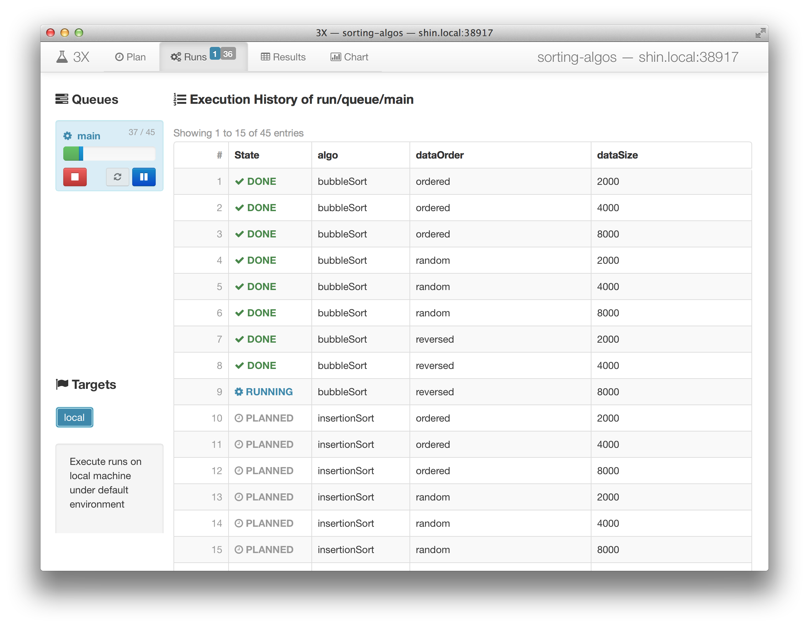


##### Monitor Progress from Command Line
From the command line, you can use the same command to view the state of runs in the current queue:

```bash
3x status
```

It will output the table of runs with updated states:

```text
DONE     algo=bubbleSort     dataOrder=ordered   dataSize=2000  #1   local  run/2013/1212/13/2336.748025000-1
DONE     algo=bubbleSort     dataOrder=ordered   dataSize=4000  #2   local  run/2013/1212/13/2339.638627000-2
DONE     algo=bubbleSort     dataOrder=ordered   dataSize=8000  #3   local  run/2013/1212/13/2341.819154000-3
DONE     algo=bubbleSort     dataOrder=random    dataSize=2000  #4   local  run/2013/1212/13/2344.039357000-4
DONE     algo=bubbleSort     dataOrder=random    dataSize=4000  #5   local  run/2013/1212/13/2347.218813000-5
DONE     algo=bubbleSort     dataOrder=random    dataSize=8000  #6   local  run/2013/1212/13/2353.233994000-6
DONE     algo=bubbleSort     dataOrder=reversed  dataSize=2000  #7   local  run/2013/1212/13/2411.194134000-7
DONE     algo=bubbleSort     dataOrder=reversed  dataSize=4000  #8   local  run/2013/1212/13/2414.869794000-8
RUNNING  algo=bubbleSort     dataOrder=reversed  dataSize=8000  #9
PLANNED  algo=insertionSort  dataOrder=ordered   dataSize=2000  #10
PLANNED  algo=insertionSort  dataOrder=ordered   dataSize=4000  #11
PLANNED  algo=insertionSort  dataOrder=ordered   dataSize=8000  #12
[...]
```


#### 3.6. Trace Failures

If your program does not finish with clean (zero) exit status for a run, or any error occurs, its state becomes `FAILED`.
For example, if you forget to plug the `.py` files into the `program/` directory, all runs fail as shown in the following screenshot.
Additionally, if you stop the execution, runs can be marked as `ABORTED`.

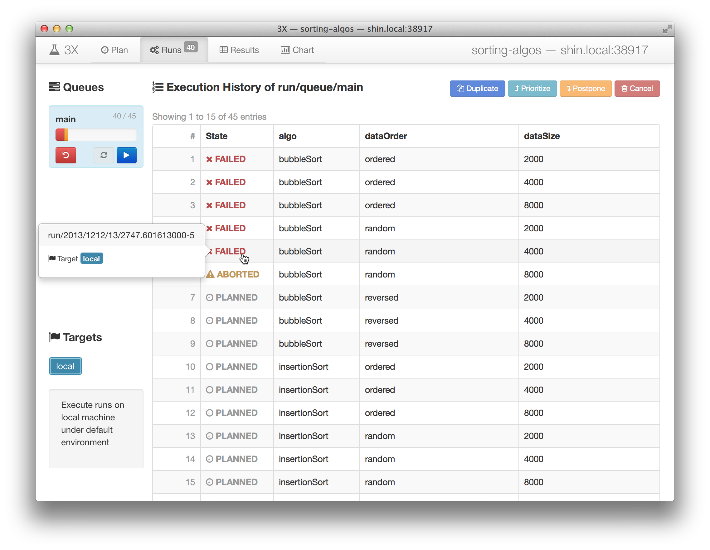

By following the link of a run in the state column (`FAILED`, `DONE`, or `ABORTED`) of the execution history table, it is possible to access the full record of the execution.

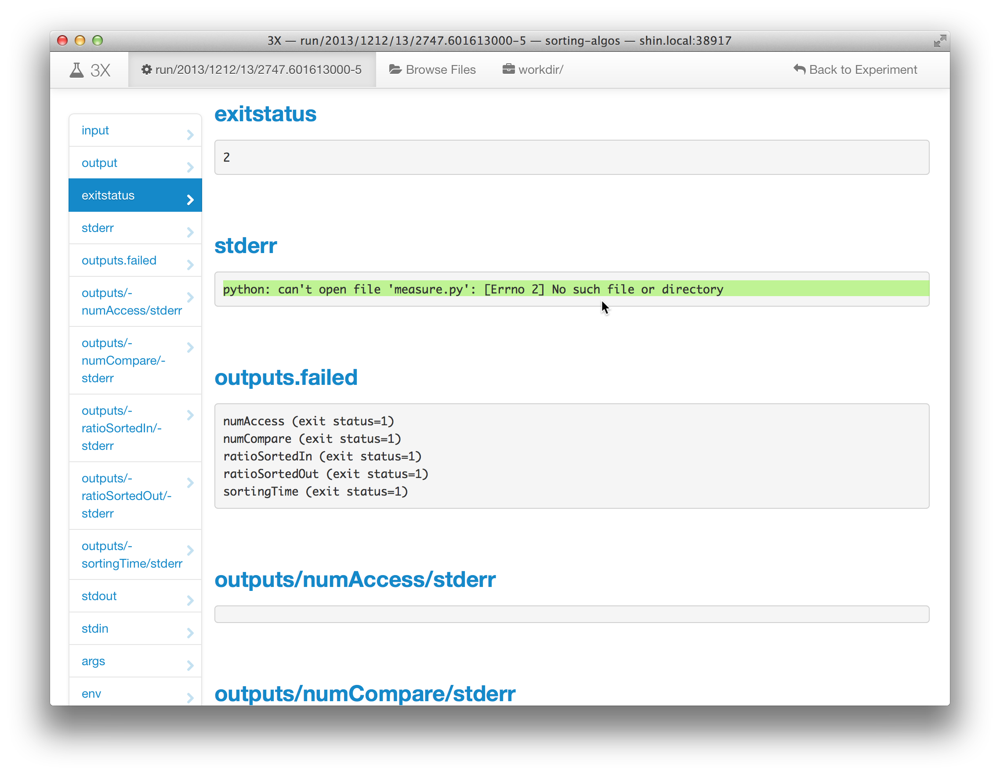


### 4. Explore Results

<span class="sans-serif">3X</span> provides two main ways with its GUI to visualize and browse the result of your experiment: with tables and charts.
Although limited in its capability for exploration, <span class="sans-serif">3X</span>'s CLI exposes many details of the result in tab-separated textual form, which can be more useful for processing data with other well-known command-line utilities.


#### 4.1. Tabulate Results

The Results tab in <span class="sans-serif">3X</span>'s GUI shows the desired part of the result in a tabular form with controls for filtering, aggregating, and projecting the input and output variables to the table.

##### Filter results by selecting the values for input variables

<!-- Selection -->
You can select which part of the results you want to view by choosing the values for the input variables individually.
The default when no value is chosen for an input variable is to show all results of runs regardless of which value was used for execution.

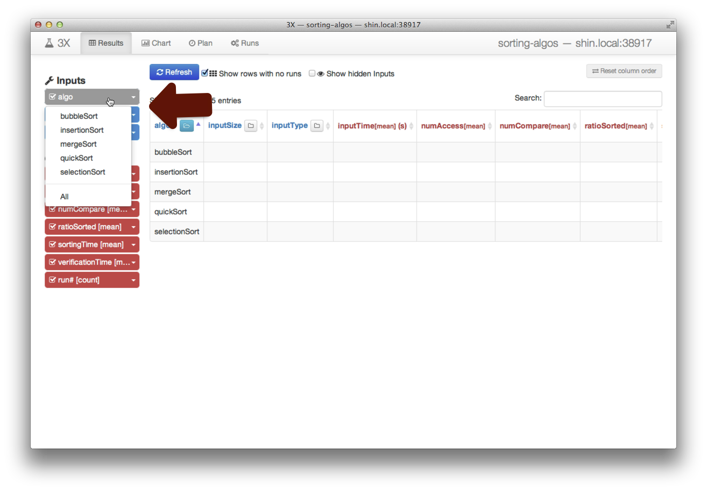

You can also specify what aggregate values of the output variables you want to see as well as simple conditions on values of them, such as equality (`=1`) or inequality (`<=12.345`) to a literal value.

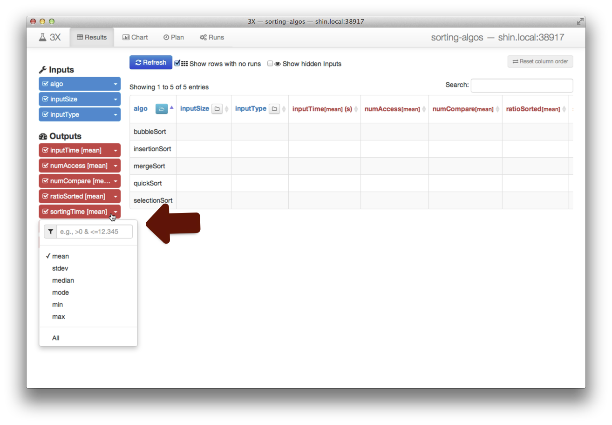

<!-- Projection -->
Note that it's possible to hide an unwanted variable from appearing in the results by checking off its checkbox <i class="icon icon-check"></i>.<!-- to <i class="icon icon-check-empty"></i> -->

##### Aggregate results by some input variables

You can easily control by which input variables the results are grouped using the buttons with folder icon labels <i class="icon icon-folder-open-alt"></i> <i class="icon icon-folder-close-alt"></i> on the table header.
When you expand a column (indicated by the open folder icon <i class="icon icon-folder-open-alt"></i>), each value of that variable will have its own row in the results table.
All runs that were executed using the particular value for a row will be grouped, and the aggregate values of their outputs will be shown in other columns.

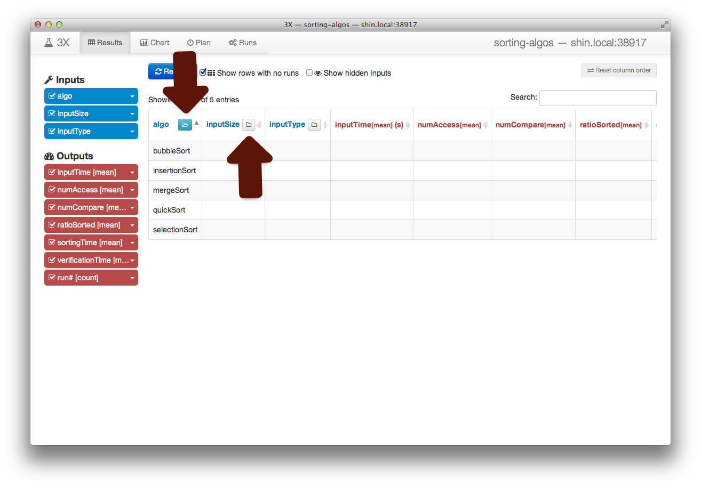

##### Sort results by columns and reorder columns

Clicking on one of the column names in the table header will sort the results table by that column in ascending order.
Clicking again will reverse the order to descending, and clicking once again will deactivate sorting for the column.
By holding the Shift Key &#8679; down while clicking on another column header, you can specify additional columns for sorting and give order to the results that were ranked equally with previously chosen columns.
Dragging a column header to the left or right will allow you to reorder the columns to shape the table for easier examination.


#### 4.2. Chart Results

The Chart tab in <span class="sans-serif">3X</span>'s GUI visualizes in chart form the data shown as a table in the Results tab.

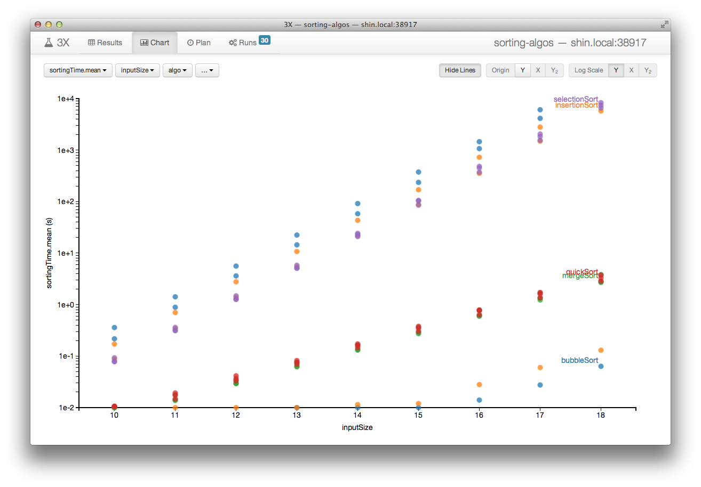

You can use the controls with pull-down menus on the top-left corner of the Chart tab to associate each column to either X- or Y-axis, or let the column divide the data into different series.
The first variable selected is used as the Y-axis, and the second one as the X-axis.
When more nominal variables are selected, data that share common values of those variables will be drawn in the same series in the chart.
When another numerical variable is further selected, it may create a second Y-axis or share the first one depending on whether the selected variables can share the *unit* for the Y-axes.


#### 4.3. Plan from Results

From the results table, we can click on a row that needs to be filled or supported by more data to plan new runs for execution.
You can repeat this process from the results table to add necessary runs to fill the output columns colored red of the specific rows you select.
Note that the button on each input column header can be used to expand and collapse the rows, so that you can add only part of the runs or a larger group of runs at a time.


#### 4.4. Detail on Demand

Both the chart and table shown in <span class="sans-serif">3X</span>'s GUI are interactive: you can drill down to details on demand.

Clicking on any of the data points plotted in the chart shows a popover menu displaying details of the subset of data that contributed to that point.
The first row in the popover shows the Y-axis value, and the rest of the rows show the X-axis value and other variables' values for the series.
If you click on the number of runs (shown in the last row labeled `run#.count`), then you can browse the individual values before aggregation, and follow the link on each value to inspect the full record of the run that generated it.

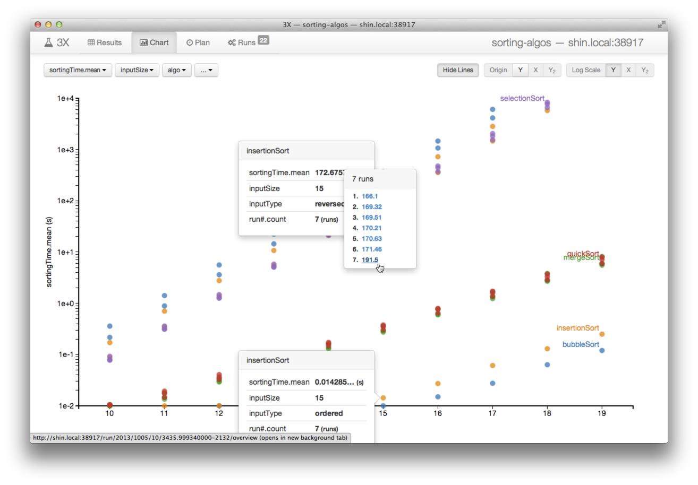

It's also possible to inspect individual values from the table.
By holding the Shift Key &#8679; down while hovering over a cell that contains an aggregated value, you can inspect each value that contributed to the aggregate and access the full record of the run that generated the individual value as well.

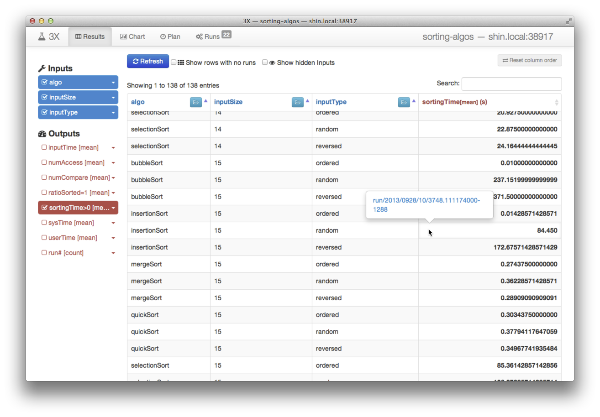


#### 4.4. Tabulate from command-line

Now, let's briefly take a look at the ways using the command-line interface to obtain raw results data.
In fact, some of the commands shown here are exactly identical to how the GUI accesses the data behind the scenes.

The following command will print full results of all executions containing the value for each input and output variable prefixed with its name in a tab-separated format and its run identifier on the first column.

```bash
3x results run/
```

Part of the output will look like:

```text
run/2013/1210/15/4445.781335000-34  numAccess=60663      numCompare=26322     ratioSortedIn=0.0005    ratioSortedOut=1  sortingTime=0.017645   algo=quickSort      dataOrder=reversed  dataSize=2000
run/2013/1210/15/4447.957292000-35  numAccess=129707     numCompare=52439     ratioSortedIn=0.00025   ratioSortedOut=1  sortingTime=0.040239   algo=quickSort      dataOrder=reversed  dataSize=4000
run/2013/1210/15/4450.166679000-36  numAccess=278503     numCompare=113782    ratioSortedIn=0.000125  ratioSortedOut=1  sortingTime=0.079223   algo=quickSort      dataOrder=reversed  dataSize=8000
run/2013/1210/15/4452.381681000-37  numAccess=2000999    numCompare=1999000   ratioSortedIn=1         ratioSortedOut=1  sortingTime=0.341218   algo=selectionSort  dataOrder=ordered   dataSize=2000
run/2013/1210/15/4454.869426000-38  numAccess=8001999    numCompare=7998000   ratioSortedIn=1         ratioSortedOut=1  sortingTime=1.351666   algo=selectionSort  dataOrder=ordered   dataSize=4000
run/2013/1210/15/4458.361686000-39  numAccess=32003999   numCompare=31996000  ratioSortedIn=1         ratioSortedOut=1  sortingTime=5.437687   algo=selectionSort  dataOrder=ordered   dataSize=8000
run/2013/1210/15/4505.969481000-40  numAccess=2006963    numCompare=1999000   ratioSortedIn=0.504     ratioSortedOut=1  sortingTime=0.349765   algo=selectionSort  dataOrder=random    dataSize=2000
run/2013/1210/15/4508.498079000-41  numAccess=8013981    numCompare=7998000   ratioSortedIn=0.503     ratioSortedOut=1  sortingTime=1.37432    algo=selectionSort  dataOrder=random    dataSize=4000
run/2013/1210/15/4512.009795000-42  numAccess=32027972   numCompare=31996000  ratioSortedIn=0.50475   ratioSortedOut=1  sortingTime=5.476741   algo=selectionSort  dataOrder=random    dataSize=8000
```


You can narrow down the output if you specify filters on some variables, e.g.,

```bash
3x results algo=quickSort,mergeSort \
           dataOrder'!='random \
           numCompare'>'5900000
```

Then it outputs only the results that match given criteria:

```text
run/2013/1210/15/4416.803759000-21  numAccess=260416  numCompare=52416   ratioSortedIn=1         ratioSortedOut=1  sortingTime=0.064872  algo=mergeSort  dataOrder=ordered   dataSize=8000
run/2013/1210/15/4436.821044000-30  numAccess=159695  numCompare=122147  ratioSortedIn=1         ratioSortedOut=1  sortingTime=0.074     algo=quickSort  dataOrder=ordered   dataSize=8000
run/2013/1210/15/4447.957292000-35  numAccess=129707  numCompare=52439   ratioSortedIn=0.00025   ratioSortedOut=1  sortingTime=0.040239  algo=quickSort  dataOrder=reversed  dataSize=4000
run/2013/1210/15/4450.166679000-36  numAccess=278503  numCompare=113782  ratioSortedIn=0.000125  ratioSortedOut=1  sortingTime=0.079223  algo=quickSort  dataOrder=reversed  dataSize=8000
```


* * *

## Example 2: Simulating Network Formations

Having a nice way to play with a few scalar values produced by your experiment may sound good enough.
However, you are very likely to encounter a situation where higher-dimensional output data, such as a time series result or a custom visualization, must be handled as well.
In this example, we will see how <span class="sans-serif">3X</span> supports these requirements.

Suppose we have an experiment that studies the rise of a giant connected component by gradually increasing the probability for creating edges between vertices while generating random graphs.
We will borrow [code from an example displayed on the gallery page][giant_component gallery] of *[NetworkX][]*, which is a popular Python Library for handling Graph Data.

[NetworkX]: http://networkx.github.io/
[giant_component gallery]: http://networkx.github.io/documentation/latest/examples/drawing/giant_component.html

### 1. Write the Program

We make several changes to the code borrowed from NetworkX, so it can be used effectively with <span class="sans-serif">3X</span>:

1. Save the result as an image file, named `giant_component.png`, instead of showing it interactively in the GUI.
2. Obtain the originally hard-coded `p` and `n` values from corresponding environment variables instead.
3. Put a single generated graph in each result for a given `p` and `n` instead of iterating over several `p` values.
4. Keep a full record of the generated random graph.

Here is our code for this experiment: [`giant_component.py`][].

When this Python script is run with `n` and `p` defined, it produces an image file `giant_component.png` that will look like:

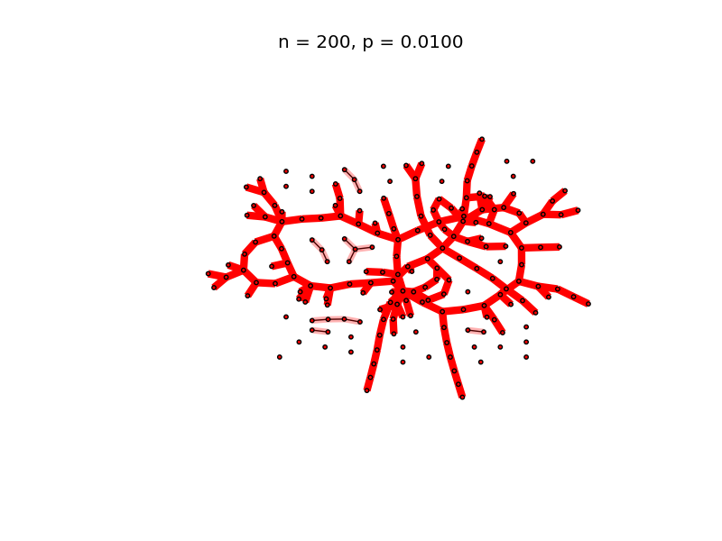

and a `graph.pickle` file in addition to standard output lines:

```text
Generated binomial graph (n=200, p=0.0100):
 0	[17, 60]
 1	[130]
 2	[129, 123, 116, 111]
 3	[122, 60, 125]
[...]
 198	[128, 49, 155, 52]
 199	[149, 62]

Created graph.pickle
Created giant_component.png
```


[`giant_component.py`]: ../examples/giant_components/program/giant_component.py


### 2. Set Up an Experiment Repository

We will use the following quick setup command to create a repository for this experiment.
On the last line for `--outputs`, `--file` tells <span class="sans-serif">3X</span> that the output variable `graph` is a file named `giant_component.png` with a MIME type `image/png`.
The <span class="sans-serif">3X</span> GUI can treat output image files specially based on this user provided MIME-type.

```bash
3x setup giant_components \
  --program 'python ./giant_component.py' \
  --inputs  n=100,200,300 \
            p=0.0{01..20} \
  --outputs --file graph:image/png=giant_component.png \
#
```

Let's make sure to put the Python code at the correct place.

```bash
cd giant_components/program/
exampleURL="https://raw.github.com/netj/3x/gh-pages/docs/examples"
curl -LO $exampleURL/giant_components/program/giant_component.py
cd -
```


### 3. Run Experiments Many Times

We can move into the repository and execute full combinations of inputs by running following commands:

```bash
cd giant_components/
3x plan n p
3x start
```

Here, `3x plan` will open your text editor to let you reorder or duplicate some of the runs.
You can simply save the presented file to confirm the runs and add them to the queue.
Once you do a `3x start`, <span class="sans-serif">3X</span> will execute all the previously planned runs in the current queue and stay executing future ones until stopped by `3x stop`.
Therefore, we can now simply throw more runs into the queue to get results from them.

Since each run of this experiment is non-deterministic, we need to execute each input many times.
This can be done by running `3x plan` multiple times as follows:

```bash
3x plan n p
3x plan n p
3x plan n p
[...]
```

Alternatively, you can duplicate the desired lines as many times as you want using your text editor without running the `3x plan` command multiple times.


### 4. Explore Results

<span class="sans-serif">3X</span> GUI is essential for browsing the results since our only output variable is of image type.

```bash
3x gui
```

#### Aggregate image with *Overlay*

The `graph` column in the results table displays the PNG image files generated by our experiment runs as in the following screenshot:

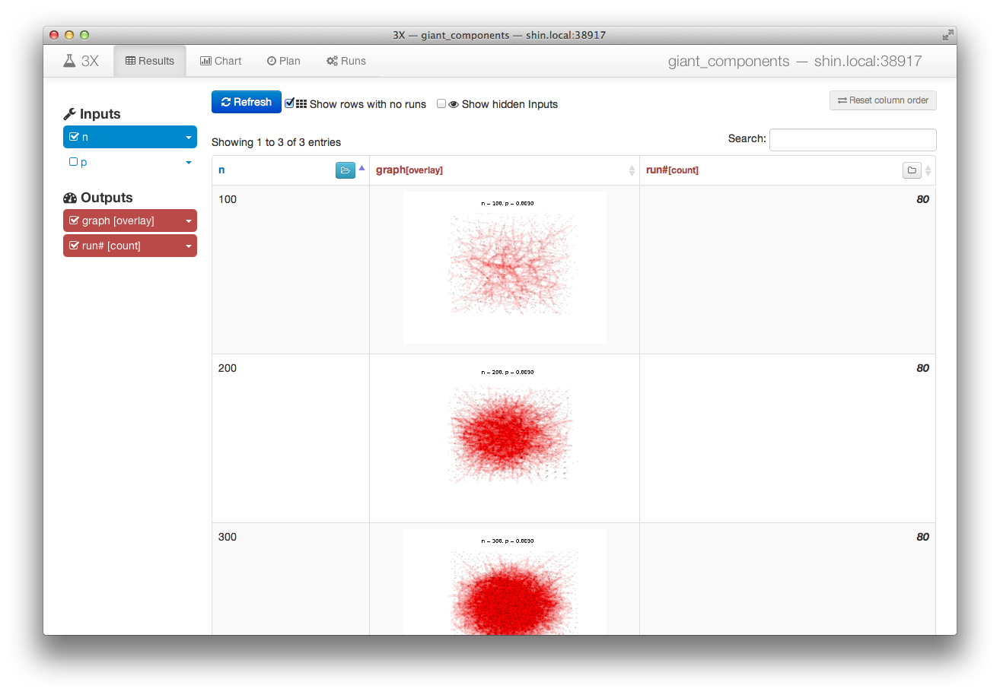

Notice here that <span class="sans-serif">3X</span> superimposes multiple images that fall into the same row, i.e., renders images on top of each other, so that any patterns or variations among them are easily discernible.
This feature is provided as a specialized aggregate function, we call *overlay*, for image file type output variables.
Overlay aggregate function can be very useful when there isn't a good scalar metric that summarizes the result or such metric is yet to be determined, and the only way to judge is for humans to look at the images that visualize the higher-dimensional data.

#### Details on Demand

Individual images can be browsed one at a time using the same *details on demand* technique, hovering over the aggregate image or another aggregate column while holding the Shift Key &#8679; down.

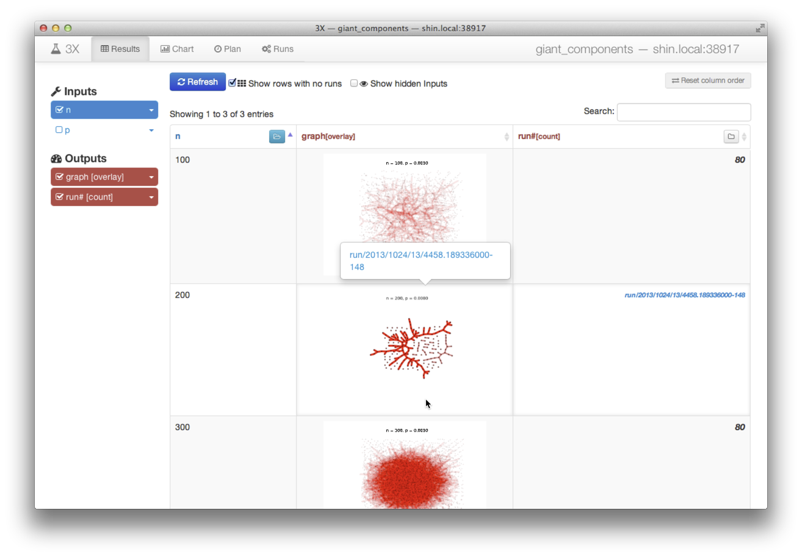

When you follow the link, the full record of the run is available as shown in the following screenshot:

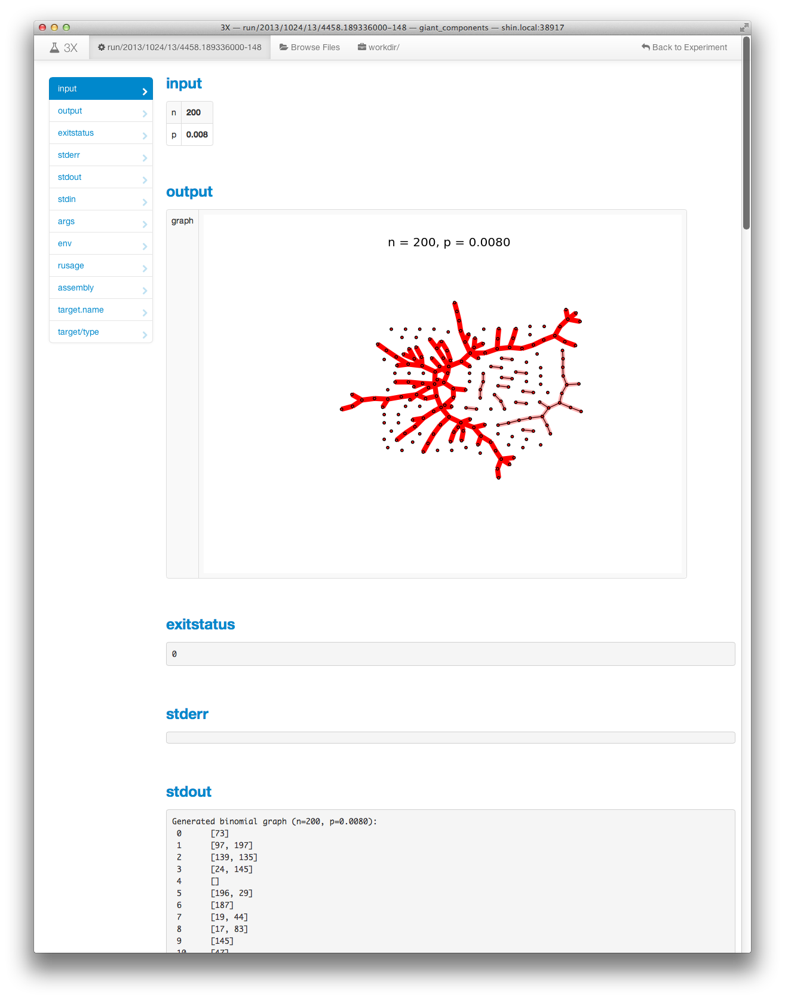

The run overview page shows the image for `graph` in full resolution as well as the full standard output that records the exact details of the generated random graph.
Any other files used for the run, such as `graph.pickle`, can be accessed through the <i class="icon icon-briefcase"></i> "workdir/" tab at the top of the page.


### 5. Analyze Results Further

Suppose you want to compute some statistics from the generated graphs after you have seen a number of them.
For example, the number of components and how large each of them may seem to be an interesting metric now.
Additionally, you may also be interested in how long each run took to generate the graph and image.

<span class="sans-serif">3X</span> allows you to define output variables incrementally, i.e., new output variables can be added later.
You can either use <span class="sans-serif">3X</span>'s default options to extract output values, or write a custom program that computes them.
<span class="sans-serif">3X</span>'s default options are either extracting the first string that matches a triple of regular expressions, or finding a generated file by name.
Here, we show all three options.


#### Extract Execution Time from Built-in Records

As default, <span class="sans-serif">3X</span> records basic profile information for every run of your experiment, such as execution time and maximum memory size using the *[GNU time][]* utility in the file `rusage`.
You simply need to define an output variable with correct regular expressions to extract those values from the record.
For example, you can extract the elapsed wall clock time of your runs as `wallTime` by running the following command:

```bash
3x define output 'wallTime(s)' \
  extract 'Elapsed \(wall clock\) time \(seconds\): '  '[0-9.]+'  '' \
  rusage
```

<span class="sans-serif">3X</span> will not only extract values for `wallTime` from future runs but also rescan records of past runs.

[GNU time]: http://www.gnu.org/s/time/


#### Compute Statistics

If a more complex computation is necessary to collect the values of interest, then plugging in a custom *output extractor* code to <span class="sans-serif">3X</span> is your option.
In fact, the two built-in options provided by `3x define output` command, namely `extract` and `file`, are mere shorthands for generating standard output extractors.
More details on output extractors are described in the next section.

For this experiment, let's say we want to see several statistics computed from the generated graph, including the number of components that have more than one vertex and the size of each component.
Since we dumped the graph to `graph.pickle`, we can load this file and easily compute the necessary values.
[`compute-stats.py`][] is one such script that prints output similar to:

```text
Number of Components (non-singleton):  7
Number of Disconnected Nodes (singleton components):  29
Component Sizes:  153	4	4	3	3	2	2
Component Size Ratios:  0.765000	0.020000	0.020000	0.015000	0.015000	0.010000	0.010000
```

We put this script directly under `output/` of the repository so it can be assembled into the `outputs/` directory of each run and easily shared across different output variables.

```bash
cd output/
exampleURL="https://raw.github.com/netj/3x/gh-pages/docs/examples"
curl -LO $exampleURL/giant_components/output/compute-stats.py
cd -
```

[`compute-stats.py`]: https://raw.github.com/netj/3x/gh-pages/docs/examples/giant_components/output/compute-stats.py


Next, we define an output variable, named `numCC`, by running the following command:

```bash
3x define output 'numCC' \
  extract 'Number of Components.*:\s*'  '\d+'  '' \
    --running 'python outputs/compute-stats.py' \
    --caching compute-stats.txt
```

The command above does the following:

* It tells <span class="sans-serif">3X</span> to extract value for the variable `numCC`
    - using the regular expression triple `Number of Components.*:\s*`, `\d+`, ` `, which are for matching the string before, of, and after the value of interest, respectively.
    - scanning the output of the `compute-stats.py` script, which is indicated by the command given after the argument `--running`.

* The output of the command will be cached at `outputs/.shared/compute-stats.txt`, so that other variables can be extracted without running it again.


We need to tell <span class="sans-serif">3X</span> to adjust other parts of the repository influenced by the new output variable by running the following command:

```bash
3x define sync
```

In this case, it will rescan records of past runs to extract values for the new output variable `numCC`.
With the new `numCC` variable, we can easily create new visualizations of the experiment results, such as the following chart, which shows mean value of `numCC` by `p` for different `n`s.
We can see the number of components, i.e., `numCC` converges down to 1 as we increase the value for `p`.

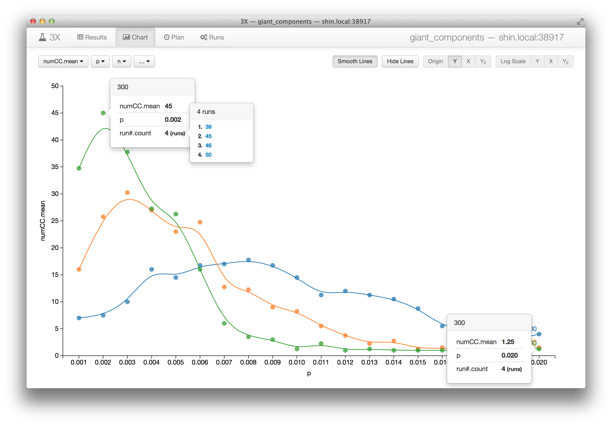


Similarly, we can define several other variables, namely `numDisconnected`, `ratioCC1`, `ratioCC2`, and `ratioCC3`, from the output of the script:

```bash
3x define output 'numDisconnected' \
  extract 'Number of Disconnected Nodes.*:\s*'  '\d+'  '' \
    --running 'python outputs/compute-stats.py' \
    --caching compute-stats.txt

3x define output  'ratioCC1' \
  extract 'Component Size Ratios:\s*'  '[.0-9]+'  '' \
    --running 'python outputs/compute-stats.py' \
    --caching compute-stats.txt

3x define output  'ratioCC2' \
  extract 'Component Size Ratios:\s*[.0-9]+\s+'  '[.0-9]+'  '' \
    --running 'python outputs/compute-stats.py' \
    --caching compute-stats.txt

3x define output  'ratioCC3' \
  extract 'Component Size Ratios:\s*([.0-9]+\s+){2}'  '[.0-9]+'  '' \
    --running 'python outputs/compute-stats.py' \
    --caching compute-stats.txt

3x define sync
```

These new variables allow us to quickly see how the first connected component's size grows compared with the second one, as shown in the next chart:

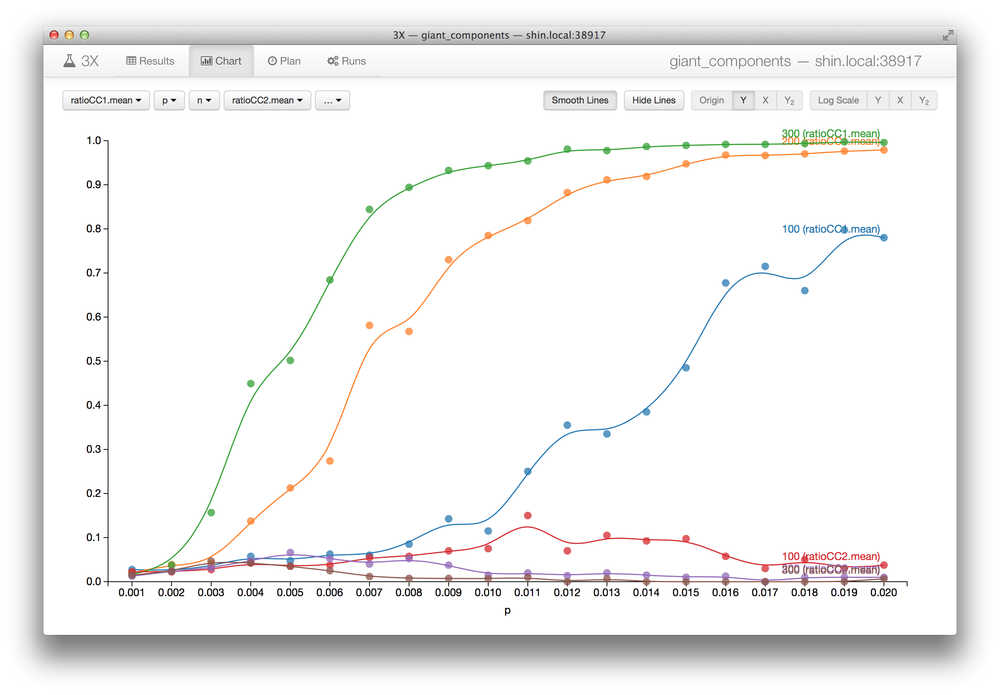

#### Notes on Output Extractors

In general, output extractor of a <span class="sans-serif">3X</span> output variable is a program that extracts the value for that variable.
It takes the form of an executable file whose name is `extract`.
You can use any language to implement it as long as the first line starts with a [shebang][] (`#!`) and its interpreter, or you name the compiled executable binary accordingly.
Each output extractor is executed after the experiment program (`run`) finishes, or when <span class="sans-serif">3X</span> rescans records of past runs.
Its current working directory is set to the run directory, so all files of the record can be easily accessed via relative paths, e.g., `stdout` or `workdir/giant_component.py`.
It must not modify any files under `workdir/` and should contain data creation and modifications under `outputs/` only.

[shebang]: https://en.wikipedia.org/wiki/Shebang_(Unix)


* * *


## Advanced Usage

Here we introduce a few more <span class="sans-serif">3X</span> features that are essential to more effective management and execution of runs in your experiment.

### 1. Execute Runs in a Different Environment

To customize the environment in which planned runs are executed, or to execute runs on a remote host or a cluster of hosts accessible via ssh, you can define new *target execution environments*, or *target* as a shorthand.

#### Add Another Local Target

Suppose we want to run our experiments with Python 3, which requires us to add special values to some environment variables, namely `PATH` and `PYTHON3PATH`.

The following command defines a target named `local2` that customizes the environment in the way we want.

```bash
3x target 'local2' \
  define local \
    PATH=/opt/python3/bin:"$PATH" \
    PYTHON3PATH=~/python3-packages \
    #
```

#### Add a Remote SSH Host Target

Suppose for a fair measurement of `sortingTime`, we want to execute the runs on a shared remote machine instead of our local machine.
As long as the remote machine is accessible via *ssh* (*Secure SHell*), <span class="sans-serif">3X</span> can execute runs on them remotely and take care of the relevant data transfer there and back.

The following command defines a target named `rocky` that executes runs on the host `rocky.Stanford.EDU` using the directory `~/3x-tmp/` for temporary storage.

```bash
3x target 'rocky' \
  define ssh 'rocky.Stanford.EDU:3x-tmp/'
```

To specify a username in addition to the hostname, prepend the username followed by a `@`, e.g., `netj@rocky.Stanford.EDU`.
If your remote host uses a non-standard SSH port (i.e., other than 22), then you can use the URL form to specify its port as well, e.g., `ssh://netj@rocky.Stanford.EDU:22/3x-tmp/`.

As with local targets, you can specify customizations to the environment variables after the URL for the remote, e.g., to tweak the `PATH` variable:

```bash
3x target 'rocky' \
  define ssh 'rocky.Stanford.EDU:3x-tmp/' \
    PATH='/usr/local/python3/bin:/usr/local/bin:/usr/bin:/bin' \
    #
```

#### Add a GNU Parallel Cluster Target

*[GNU Parallel][]* is a handy tool for launching multiple processes of a program, remotely as well as locally, in parallel to handle large numbers of inputs.
It is especially useful when we have SSH access to a cluster of remote machines that does not have a dedicated job scheduler.
<span class="sans-serif">3X</span> supports GNU Parallel as a type of execution target, so you can get results of multiple runs much earlier by leveraging the compute power of those ordinary machines.
You can simply specify a list of remote hosts and use it as another target without knowing anything about GNU Parallel, since <span class="sans-serif">3X</span> abstracts away the complex operation instructions for the tool.

[GNU Parallel]: https://www.gnu.org/software/parallel/

The following command defines a target named `corn`:

```bash
3x target 'corn' \
  define gnuparallel \
    '.3x-remote' \
    '/tmp/3x-tmp-netj/' \
    'corn'{01..30}'.stanford.edu' \
    #
```

that

* executes runs with 30 machines: `corn01.stanford.edu`, ..., `corn30.stanford.edu`.
    <br><small>
    (Note that `{01..30}` is a special syntax for your shell to expand to 30 words, which might not be supported by older versions.
    In that case, enumerate all the names as arguments instead.)
    </small>
* uses `/tmp/3x-tmp-netj/` as working directory on each machine, and 
* puts shared data under directory `~/.3x-remote/` assuming it is accessible across all machines.


#### Switch between Targets

Now, assuming you have several targets defined in your repository, you can switch the target for the current queue by specifying only the name of the target, as shown in the following command for `rocky`:

```bash
3x target 'rocky'
```

After switching, you can start executing on the new target by running:

```bash
3x start
```

To switch back to the `local` target, run:

```bash
3x target 'local'
```


More usage related to <span class="sans-serif">3X</span> targets can be accessed via the following command:

```bash
3x target -h
```


### 2. Use Multiple Queues

Any <span class="sans-serif">3X</span> command related to planning or executing runs operates on the *current queue*.
Once you begin to use multiple targets, it could be convenient to use separate queues for each target.

#### View Queue Status and the Current Queue

To check the status of every queue as well as which is the current queue, use the command without any argument:

```bash
3x queue
```

It will output something similar to:

```text
#  QUEUE       STATE     #PLANNED  #RUNNING  #ABORTED  #FAILED  #DONE  TARGET
*  main        INACTIVE  22        0         0         28       2137   local
```

The asterisk character `*` in front of the queue name indicates it is the current queue.

#### Add and/or Switch to a Different Queue

To add a new queue, simply specify the name of the queue to the `3x queue` command, say `test-queue`:

```bash
3x queue 'test-queue'
```

It will output lines similar to the following, indicating a new empty queue is created:

```text
#  QUEUE       STATE     #PLANNED  #RUNNING  #ABORTED  #FAILED  #DONE  TARGET
*  test-queue  INACTIVE  0         0         0         0        0      ?
   main        INACTIVE  22        0         0         28       2137   local
```

If you specify name of an existing queue, <span class="sans-serif">3X</span> will simply change the current queue to that one.


#### Set the Target for a Queue

To specify which target to use for the current queue, use the following command:

```bash
3x target 'corn'
```


You can also specify the target to be used for the queue at the time you create or switch to the queue:

```bash
3x queue 'test-queue' 'corn'
```

It will also set the target for the queue:

```text
#  QUEUE       STATE     #PLANNED  #RUNNING  #ABORTED  #FAILED  #DONE  TARGET
*  test-queue  INACTIVE  0         0         0         0        0      corn
   main        INACTIVE  22        0         0         28       2137   local
```


More usage related to <span class="sans-serif">3X</span> queues can be viewed via the following command:

```bash
3x queue -h
```

The concept of current queue only applies to the commands of command-line interface: <span class="sans-serif">3X</span> GUI will provide separate buttons and listings for each queue to control and manage them.


<link rel="stylesheet" href="https://netdna.bootstrapcdn.com/font-awesome/3.2.1/css/font-awesome.css" />

<!-- fancyBox for enlarging images -->
<script src="https://codeorigin.jquery.com/jquery-1.10.2.min.js"></script>
<link rel="stylesheet" href="https://cdnjs.cloudflare.com/ajax/libs/fancybox/2.1.5/jquery.fancybox.css" media="screen" />
<script src="https://cdnjs.cloudflare.com/ajax/libs/fancybox/2.1.5/jquery.fancybox.pack.js"></script>
<!-- wrap img's with figure and use figcaption instead of alt text -->
<style> figcaption { font-size: 90%; text-align: center; } </style>
<script>
$(function() {
    $("img").each(function(idx,img) {
        var $img = $(img);
        if ($img.closest("figure").length == 0) {
            $img.wrap($("<figure>"));
            $("<figcaption>").text($img.attr("alt")).insertAfter($img);
            $img.wrap($("<a>").attr("href", img.src));
        }
    });
    $("figure a").fancybox();
});
</script>
